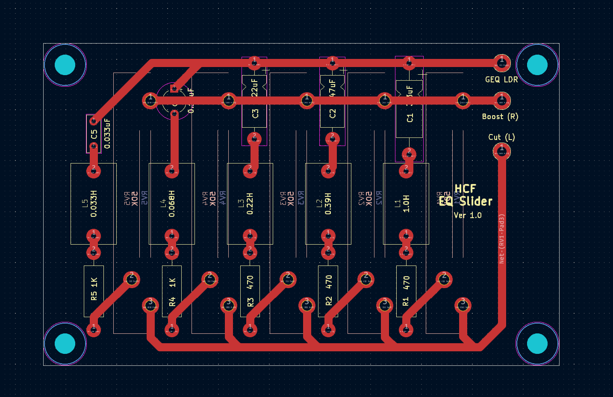
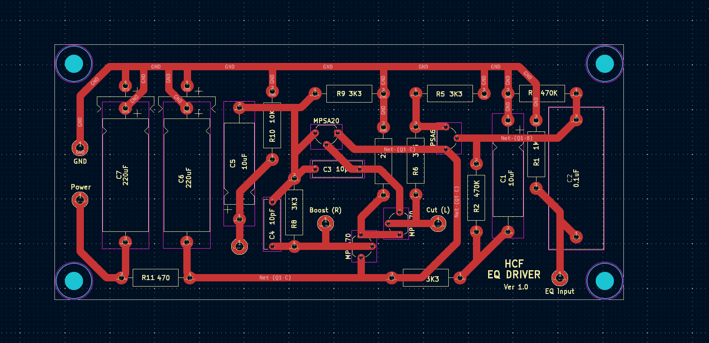

# Graphic EQ

## Overview
The 5-Band Graphic Equalizer for the IICPP consists of two parts, the EQ Driver and the EQ Slider Board. 
In conjunction, they can boost or cut frequencies at 80Hz, 240Hz, 750Hz, 2200Hz and 6600Hz.

## Status
  - Schematics, PCB Designs, and Gerbers for V1.0 of both the Driver and Slider Boards are complete.
  - Gerbers generated for JLCPCB manufacturing.

## Bill Of Materials
  - [Link to Google Sheet](https://docs.google.com/spreadsheets/d/1ZE0vuGfygjLFiTaHai0WybOM6v7LY0qXNIPXHzz1JHo/edit?gid=0#gid=0)

## Notes
  - MPSA70 is discontinued.
    - Options are NOS, finding drop-in replacement, or finding suitable alternatives for ALL transistors.
  - T322/T110 Tantalum Caps are expensive.
    - T322/T110 were used in some originals, but Cheaper Tant Caps (T356), Film Caps, or Orange Drop Caps also apparently work.
    
## To-Do/Future Plans
  - Order V1.0 Boards
  - Find Suitable Transistor Replacements

## Images
Slider V1.0:

Driver V1.0

