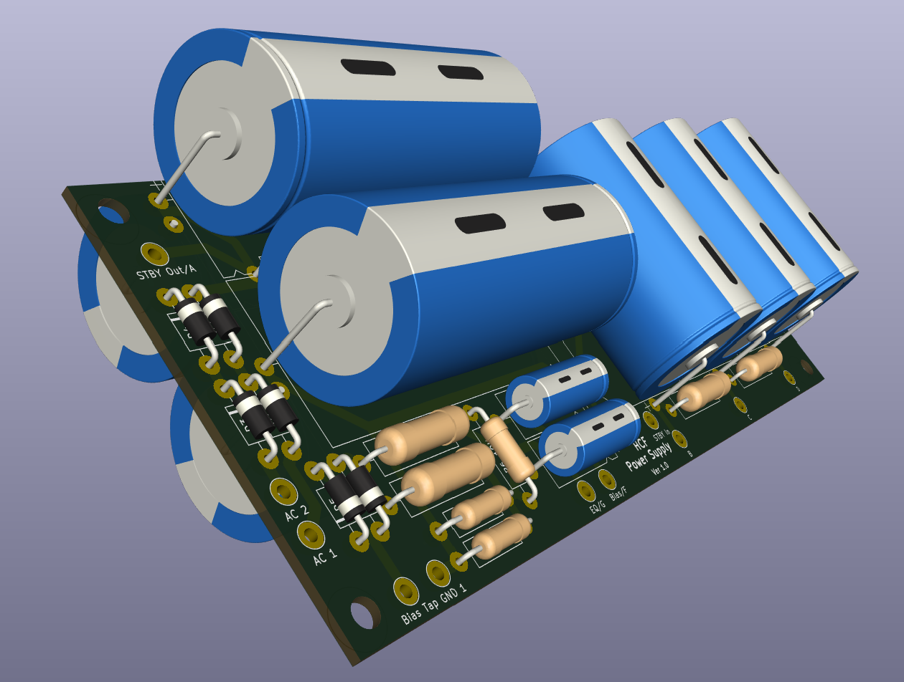

# Power Supply

## Overview
The Power Supply for the IICPP contains the Main HT/B+ Taps as well as the Bias and Graphic EQ Power Supplies.

The board supports x2 and x4 300V 220uF Reservoir Caps, as the number differs between the 60W, 100W, and Simul-Class versions.

## Status
  - Schematic, PCB Design, and Gerber for V1.0 of the Power Supply Board are Complete.
  - Gerbers generated for JLCPCB Manufacturing.

## Bill Of Materials
  - [Link to Google Sheet](https://docs.google.com/spreadsheets/d/1ZE0vuGfygjLFiTaHai0WybOM6v7LY0qXNIPXHzz1JHo/edit?gid=810989497#gid=810989497)

## Notes
  - Bias Supply for SLOCLONE/DANO, Mesa Boogie, and JRB32 Schematics are incorrect. The correct Bias Supply Schematic is used in this V1.0, which was traced from original IIB and IIC+ Power Supply Boards.
  - Bias Supply Validated [Here](https://boogieforum.com/threads/iic-tune-up-and-restoration-updated.68183/)
  - Correct and Incorrect Bias Supply Versions can be found in [Experiments](../Experiments)
    
## To-Do/Future Plans
  - Add/Remove Taps based on Power Transformer. Currently looking at Hammond 291ZZ.

## Images
Power Supply V1.0:

